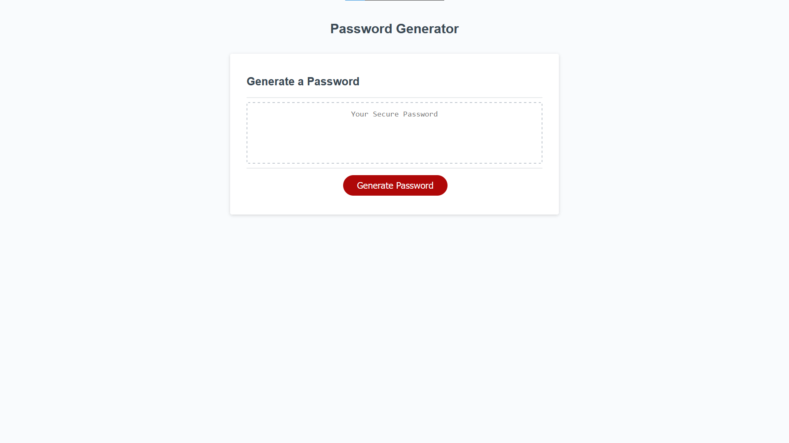

# EasyPass

## Description

A password generator that will create your very own unique password. It uses window alerts / prompts to question users as to the password specifications they want to use.

## Installation

N/A

## Usage

Go to https://svensalyard.github.io/EasyPass/ to acces the website. Press the generate password button and answer the prompts to generate the password.
Then copy the final password from the text box.

## Credits

The starter code from the third challenge.

## License

Go to the code to see the license.